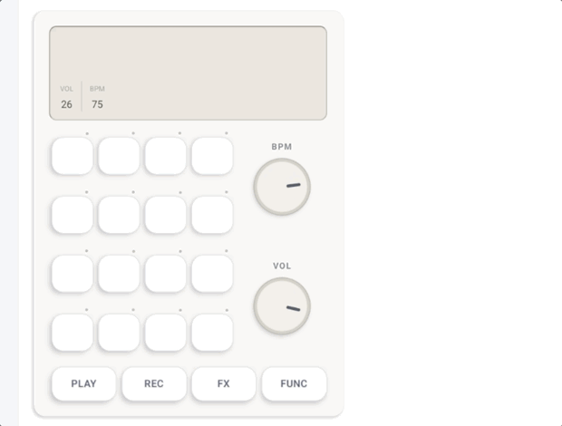

<p align="center">
	
</p>

# Something Sampler

Something Sampler is a pocket-sized sample sequencer for mobile. It takes inspiration from Teenage Engineering's Pocket Operator range: tactile pads, modifier buttons, a small step sequencer, and a deliberately immediate workflow.

The app is built with Expo and React Native. It currently supports loading audio files onto pads, previewing them, programming a 16-step pattern, and playing that pattern through a native audio engine.

## Stack

- Expo SDK 54 and Expo Router
- React Native 0.81 with TypeScript
- `react-native-audio-api` for sample playback and scheduling
- Zustand for sequencer, mode, and button state
- Expo Document Picker for loading audio files
- React Native Gesture Handler and Reanimated for pad and knob interactions
- Jest and Testing Library for tests
- Storybook for component development
- EAS Build and Expo Dev Client for native development builds

## Development setup

### Requirements

- Node.js and npm
- An Android device or emulator, iOS device or simulator, or web browser
- An Expo account for EAS development builds
- Android Studio and the Android SDK for local Android builds

For an Android tablet connected over USB-C, Android Platform Tools provides `adb`:

```bash
brew install android-platform-tools
adb devices
```

Enable USB debugging on the tablet and accept the authorization prompt. The device should appear as `device`.

### Install dependencies

```bash
npm install
```

### Start Metro

```bash
npm run start
```

Useful platform commands:

```bash
npm run android
npm run ios
npm run web
```

Because the app uses the native `react-native-audio-api` module, use a development build rather than Expo Go.

### Create a development build

Install the EAS CLI if needed:

```bash
npm install --global eas-cli
eas login
```

Create the Android development APK:

```bash
npx eas-cli build --profile development --platform android
```

The `development` profile in `eas.json` creates an installable Android APK with the Expo Dev Client. Install the completed APK on the tablet, then start the bundler:

```bash
npx expo start --dev-client
```

Press `a` in the Expo terminal or open the installed development build on the tablet. If the device cannot reach the computer over the local network, use:

```bash
npx expo start --dev-client --tunnel
```

For iOS development builds, use the appropriate EAS profile and Apple credentials. The configured development profile targets an iOS simulator, while the Android target is an APK.

## Using the sampler

The device has 24 pads, a 16-step sequencer, PLAY/REC/FX/FUNC modifier buttons, and BPM and volume knobs.

### Load a sample

1. Hold `REC`.
2. Press the step or pad where the sample should be loaded.
3. Choose an audio file in the system document picker.
4. The sample is assigned to that pad and preloaded for playback.

The info panel lists loaded samples and their assigned pads. Samples are currently selected one at a time through the document picker and are held in the current app session.

### Preview a sample

1. Hold `PLAY`.
2. Press a pad with a loaded sample.

The sample plays immediately without changing the programmed pattern.

### Program a pattern

1. Select a pad by pressing it, or use `FUNC` plus a step to select it.
2. Press individual steps to toggle them on or off.
3. Press `PLAY` to start the sequencer.
4. Press `PLAY` again to stop it.

The active step is highlighted during playback. Each enabled step triggers the selected pad's loaded sample.

### Modifier shortcuts

These are touch-based Pocket Operator-style shortcuts, not physical keyboard shortcuts:

| Hold    | Press a step to                                                |
| ------- | -------------------------------------------------------------- |
| `REC`   | Load a sample onto the step's pad                              |
| `PLAY`  | Preview the step's loaded sample                               |
| `FUNC`  | Select the step's pad for programming                          |
| `FX`    | Enter the effects action path; effects are not implemented yet |
| Nothing | Toggle the selected pad's step on or off                       |

The `REC`, `FX`, and `FUNC` buttons are currently interaction scaffolding. `REC` and `FUNC` participate in the workflows above; `FX` currently records an action but does not change audio.

### Adjust BPM and volume

- Drag the `BPM` knob to change tempo from 20 to 300 BPM.
- Drag the `VOL` knob to change master volume from 0 to 100%.
- The current BPM and volume are shown on the display.

## Storybook

Run the React Native component catalog with:

```bash
npm run storybook
```

## Tests and formatting

```bash
npm run test:ci
npm run format:check
```

For watch mode and automatic formatting:

```bash
npm test
npm run format
```

## Project structure

```text
app/                 Expo Router screens
components/          UI and sampler controls
audio/               Native audio engine and scheduling
state/               Zustand stores
layout/              Layout primitives
theme/               Design tokens, fonts, and theming
assets/              Fonts and images
api/                 API helpers
queries/             React Query hooks
storybook-app/       Storybook entry point
```

## EAS profiles

The repository includes three EAS profiles:

- `development`: Expo Dev Client build; Android APK
- `preview`: internal Android APK distribution
- `production`: store distribution

Build commands:

```bash
npx eas-cli build --profile development --platform android
npx eas-cli build --profile preview --platform android
npx eas-cli build --profile production
```

## License

Personal starter kit — free to use across personal projects.
